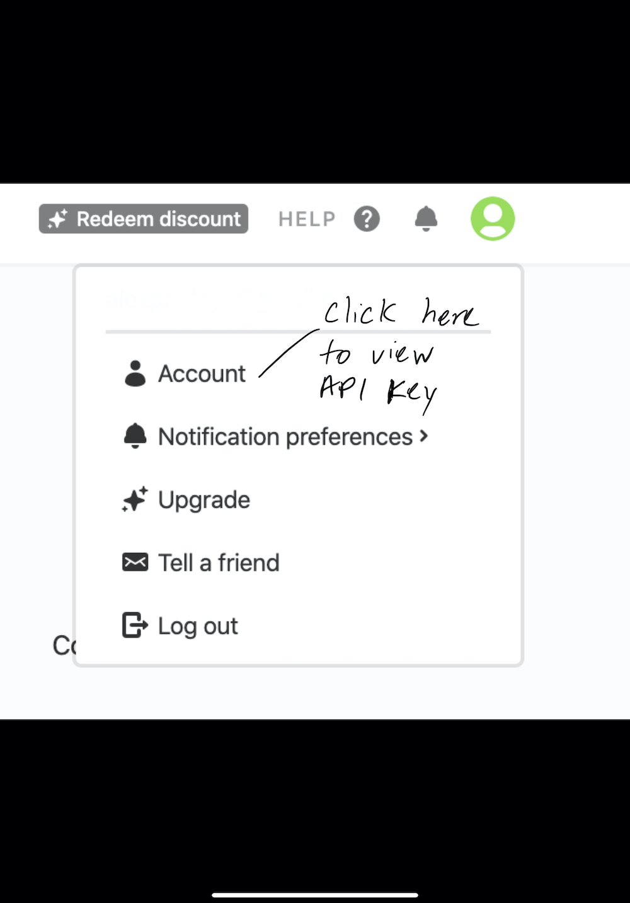
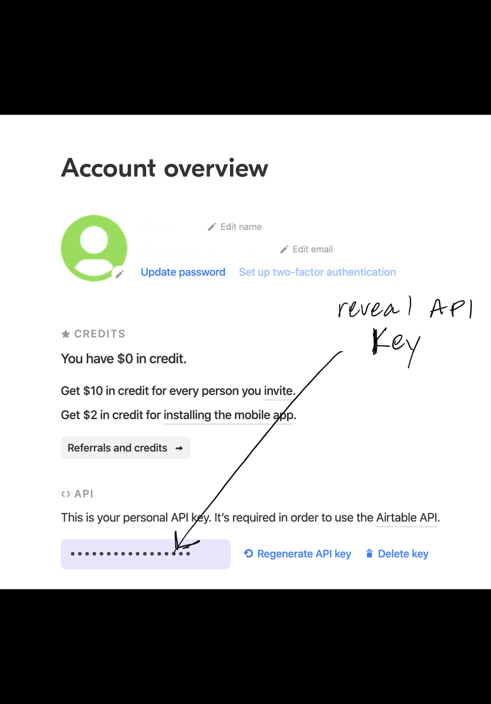
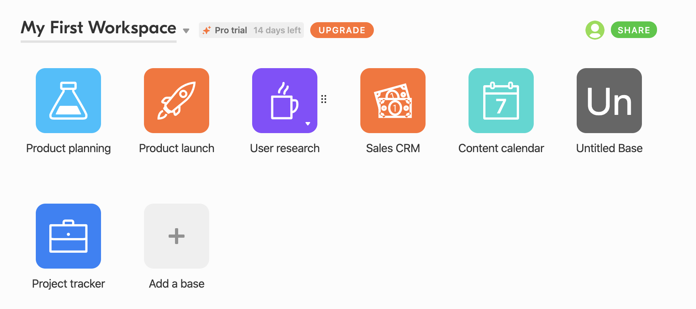
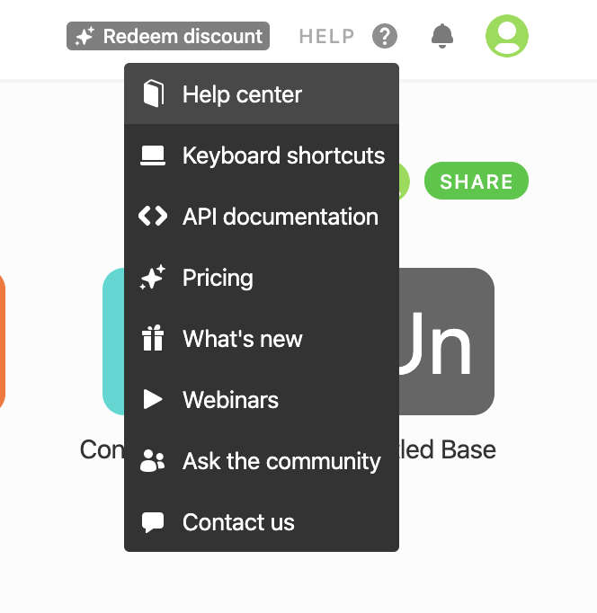
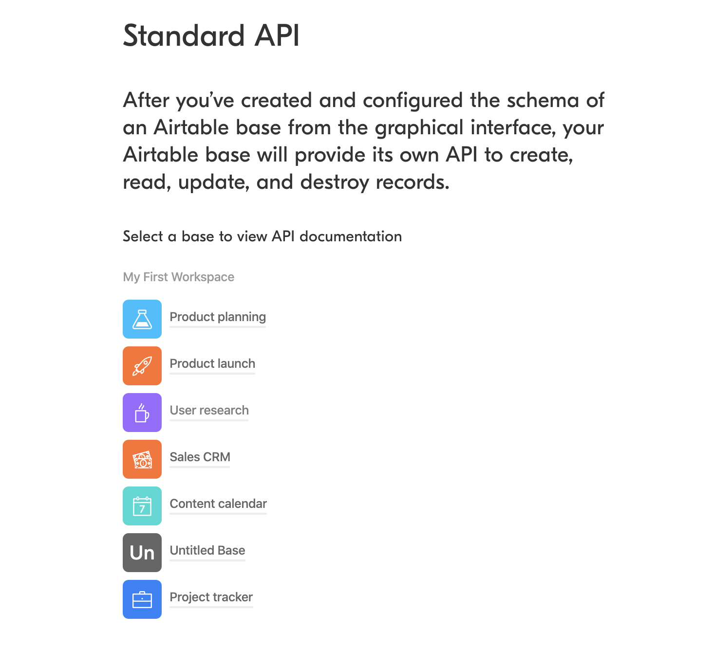
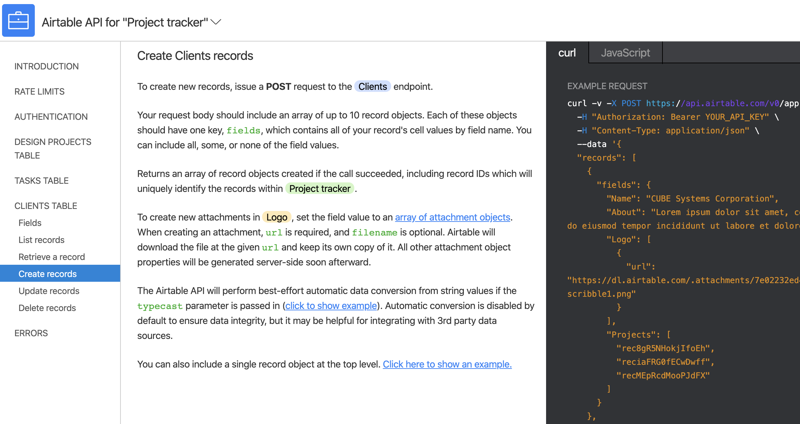
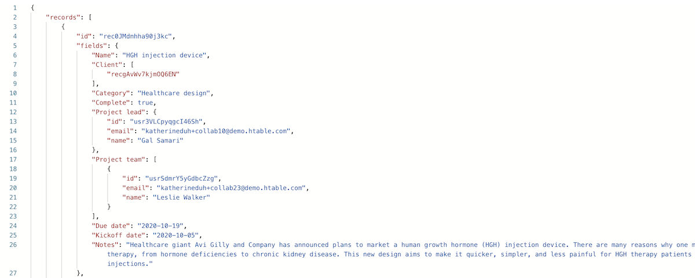

# Airtable-API-Setup

This document walks you through the resources needed to get setup with an Airtable API key and a Project tracker workspace key. First sign up to an Airtable account [here](https://airtable.com/). Once sign up follow step 1 below to get your API key. You will also need the Project tracker key to continue on to step 6 to make a GET request to get the Project tracker data.

## 1. Account 


## 2. Access API Key 


## 3. Workspaces include Project Tracker workspace
You will only be interacting with the "Project Tracker" workspace which you have by default once you sign up and login to your Airtable account



## 4. Help menu 
Step to get your project key. Click on the help menu at the top right and select "API documentation"


## 5. API documentation
Once in the API documentation, click on the Project tracker


## 6. Project tracker - create records API documentation
After clicking on the Project tracker your project id key will be in the curl request line to the top right, starts with /app_________


>After getting your (Project tracker key) and you (API key) this GET request endpoint will work in Postman to get back the data from your Project tracker `https://api.airtable.com/v0/(Project tracker id goes here)/Design%20projects?typecast=true&&api_key=(API key goes here)`

#### Postman GET response to get back Project tracker data (see endpoint above)


## 7. Making a POST request to the Project tracker 

POST endpoint `https://api.airtable.com/v0/(Project tracker goes here)/Design%20projects?typecast=true&api_key=(API key goes here)`   
Headers: "application/json" "Content-Type"

This is a sample JSON HTTP body (This would be your Swift model that you convert to Data using JSONEncoder to Post to the Project tracker)   
```json 
{
	"records" : [
		{
			"fields": {
				"Name": "Saint Lucia",
				"About": "Tropical Island Paradise with a drive-in volcano. Known as Helen of the West.", 
				"Project images": [
					{
						"url": "http://www.premiumcaribbean.nl/wp-content/uploads/2017/08/Piton-Soufriere-1024x659.jpg"
					}
				]
			}
		}
	]
}
```
